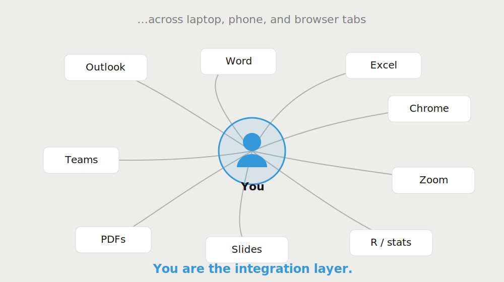
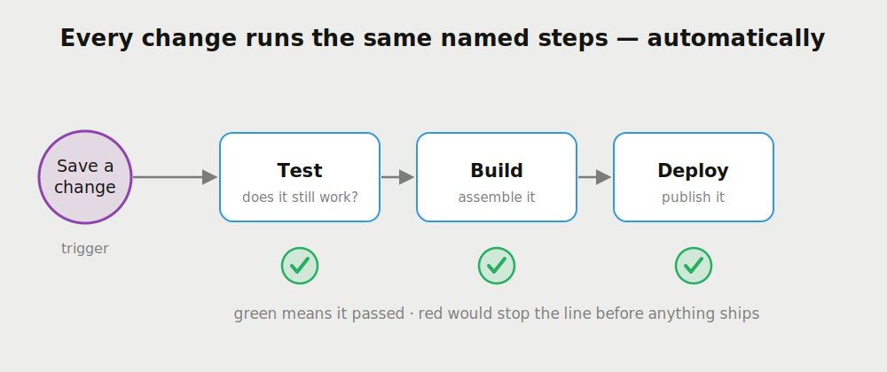
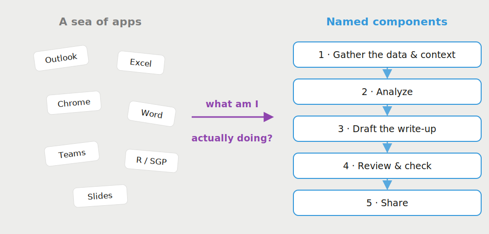
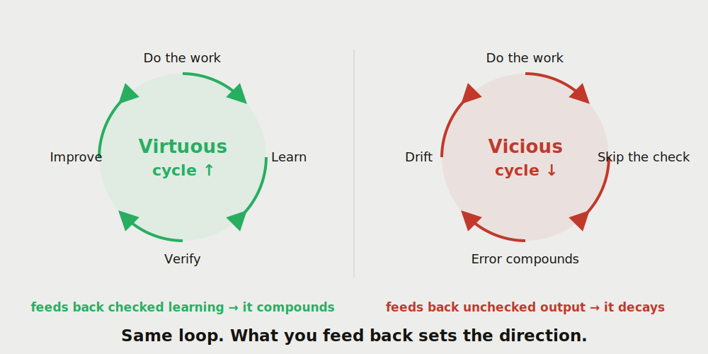
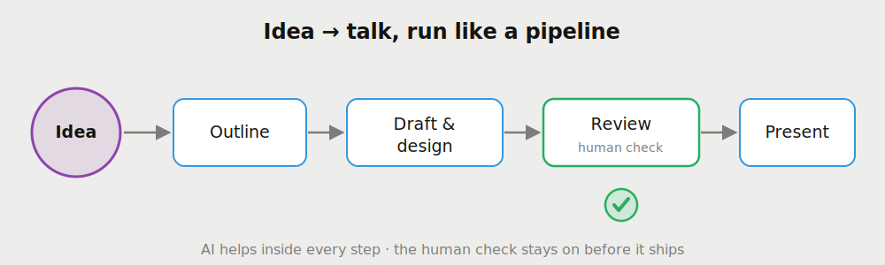

## The next 15 minutes {.center}

::: {.visually-hidden}
Roadmap for the talk
:::

::: {style="font-size: 1.1em;"}
1. What a **workflow** actually is
2. What workflows look like **in the wild** — and where they get **structured**
3. How **AI** supports a workflow
4. Why workflows **loop** — and why the direction of the loop is everything
:::

::: {.key-insight}
**One question runs through the whole talk:** *what am I actually doing here?* You can't get help — from a colleague or from AI — with work you can't yet see.
:::

::: {.notes}
0:00–0:30. Set expectations. Q&A is at the very end, after everyone, so I'll keep moving. The through-line is the introspective question in the title. Don't linger — move to the first section.
:::


# What is a workflow? {.center}

::: {.visually-hidden}
Section one: what is a workflow
:::

::: {.notes}
Section marker. ~3–4 minutes for this whole first part. Keep it conversational — this is the "meet people where they are" section.
:::


## A workflow is just: how the work actually gets done

- Not the org chart. Not the project plan. The **real sequence of steps** — clicks, copies, saves, sends — that turns a request into a finished thing.
- For most of us it's **undocumented** and lives only in our heads and our habits.
- And it is almost never one tool. It's a **relay across many tools**, with **you** carrying the baton between them.

::: {.key-insight}
**If you've ever exported from one app just to paste into another, you were the connector between two steps of a workflow.**
:::

::: {.notes}
0:30–1:30. Define workflow in plain language. The point: everyone in this room runs workflows all day; they just don't call them that. The export-and-paste line usually gets a knowing nod. Teeing up the next slide's picture.
:::


## Workflows in the wild

{width="66%" fig-alt="A person labeled 'You' at the center, connected by tangled lines to app chips: Outlook, Word, Excel, Chrome, Teams, Zoom, PDFs, Slides, and R. Caption: you are the integration layer."}

::: {.notes}
1:30–2:45. This is the mirror-held-up-to-the-room slide. Walk the picture: email in Outlook, data in Excel, a report in Word, references in Chrome, a meeting in Zoom, analysis in R — and the only thing connecting them is a human moving between them, on more than one device. Land the caption out loud: "you are the integration layer." That's not a complaint — it's a description. Hold a beat.
:::


## The tell: coordination is invisible work

::: {.columns}
::: {.column width="54%"}
- The apps are visible. The **coordination between them** is not.
- It lives in memory, sticky notes, and "I'll remember to update that later."
- It's where things **fall through**: the stale number, the version that didn't get sent, the step you redo every single time.
:::
::: {.column width="42%"}
::: {.key-insight-box}
::: {.key-insight-box-title}
The reframe
:::
The bottleneck usually isn't any one app. It's the **hand-offs** — and those are exactly what a human keeps in their head.
:::
:::
:::

::: {.notes}
2:45–3:45. The cost of being the integration layer is that the most important part of the work — the seams — is the part nobody can see, including us. Name a concrete failure everyone recognizes (a number that went stale between the spreadsheet and the report). This sets up why "structure" matters next.
:::


# Where structure exists {.center}

::: {.visually-hidden}
Section two: structured workflows
:::

::: {.notes}
Transition. ~2–3 minutes. We've seen the messy end of the spectrum. Now the other end — a field that made its workflows explicit. Software.
:::


## Some fields wrote their workflow down

Software developers hit the same problem years ago: too many manual hand-offs, too many things falling through. Their answer was to make the workflow **explicit and automatic**.

{width="72%" fig-alt="A pipeline: saving a change triggers Test, then Build, then Deploy, each with an automatic green check underneath."}

::: {.notes}
3:45–5:00. Introduce CI ("continuous integration") without jargon: whenever someone changes the work, a checklist runs by itself. Test → build → publish, and it either passes or it stops. Emphasize the green checks: the machine does the checking, every time, the same way. This is a workflow that watches itself.
:::


## The same idea, in three lines

::: {.columns}
::: {.column width="46%"}
```yaml
when:  a change is saved
do:    run the checks
then:  publish only if ✓
```

Not real code you need to read — just the **shape**: a trigger, the steps, and a gate that won't let broken work through.
:::
::: {.column width="50%"}
::: {.key-insight}
**What structure buys you:** the workflow becomes **named** (you can point at each step), **automatic** (it runs without you remembering), and **observable** (you can see where it passed or failed).
:::

Most of our workflows have none of these three. That's the gap AI can help close.
:::
:::

::: {.notes}
5:00–6:15. The tiny snippet is a prop, not code to read — say that explicitly so non-technical folks relax. The three properties (named, automatic, observable) are the payoff of the whole section; repeat them. Then the pivot: our everyday workflows are none of these — and closing that gap is where AI comes in.
:::


# How AI supports a workflow {.center}

::: {.visually-hidden}
Section three: how AI supports workflows
:::

::: {.notes}
Transition to the core of the talk. ~3 minutes. The key move is NOT "AI does my job." It's "AI helps me see and then strengthen the seams."
:::


## First move: introspection, not automation

Before automating anything, answer the title question — *what am I actually doing?* Turn the sea of apps into a handful of **named components** and the **connections** between them.

{width="70%" fig-alt="On the left a scattered cloud of apps; an arrow labeled 'what am I actually doing?' points to five named, connected steps on the right: gather, analyze, draft, review, share."}

::: {.notes}
6:15–7:30. The single most useful thing AI does early is help you narrate your own workflow back to yourself. Describe a task to it in plain words and it will help you break it into gather → analyze → draft → review → share. Once the components are named, each connection becomes a candidate for help. You can't improve a blur; you can improve a list.
:::


## AI plugs in at the seams

::: {.columns}
::: {.column width="52%"}
Once the steps are named, AI helps **inside a step** and **between steps**:

- **Inside:** draft the memo, clean the columns, summarize the PDF, write the R snippet.
- **Between:** carry context from one step to the next so *you* aren't the only thing holding it.
:::
::: {.column width="44%"}
::: {.theorem-box}
::: {.theorem-box-title}
The role AI plays
:::
Not a replacement for the human in the loop — a **second worker** you delegate pieces to, while you keep judgment, direction, and the final call.
:::
:::
:::

::: {.notes}
7:30–8:30. Two places AI helps: within a task and at the hand-offs. Stress the hand-offs — that invisible coordination work from earlier is exactly what AI is good at carrying. And keep the guardrail visible: you stay in the loop; AI is the second pair of hands, not the decision-maker.
:::


## A real example: going deeper, not just faster

::: {.columns}
::: {.column width="56%"}
In my own research I've been chasing a genuinely **hard methods question** — one I'd normally have to simplify just to make tractable.

With AI inside the workflow I could:

- **stress-test** many more cases and assumptions than I'd check by hand,
- **formalize** arguments more carefully, and
- **keep going** down paths I'd usually abandon for time.
:::
::: {.column width="42%"}
::: {.key-insight-box}
::: {.key-insight-box-title}
The surprising part
:::
The value wasn't mostly **speed**. It was **reach** — AI let me go **deeper** into the problem than I could have alone.
:::
:::
:::

::: {.notes}
8:30–9:45. Keep this high-level — no math. The honest headline: people expect AI to save time, and it does, but the bigger effect for hard analytic work was depth. It let me pursue the version of the question I'd otherwise have rounded off. I stayed fully responsible for every claim — AI extended my reach, it didn't replace my judgment. This is the emotional center of the talk; slow down here.
:::


## Depth is the real dividend

::: {.key-insight}
**For a sea-of-apps workflow, AI's first gift is clarity** — seeing what you do. **For a hard analytic workflow, its gift is depth** — going further into what you do than time and working memory normally allow.
:::

- Same tool, two different wins, depending on where you start.
- Both only land if you've done the introspection first — you have to know what you're doing to hand any of it off.

::: {.notes}
9:45–10:30. Tie the two halves of the talk together: clarity for the messy workflows, depth for the hard ones. Both depend on the introspection step. Then pivot to the last idea — this all gets more powerful, and more dangerous, when the workflow repeats.
:::


# Workflows loop {.center}

::: {.visually-hidden}
Section four: workflows loop
:::

::: {.notes}
Final section. ~3 minutes. The most important conceptual point of the talk. Don't rush it even if time is tight — cut earlier notes instead.
:::


## Good workflows feed back into themselves

- Most real work isn't one pass — it **repeats**. This quarter's report is next quarter's starting point.
- What you **learn** in one pass can be **fed back** to make the next pass better.
- That feedback is what turns a workflow into a **loop** — and loops **compound**.

::: {.key-insight}
**Compounding is the whole game.** A small improvement fed back every cycle grows; a small error fed back every cycle also grows.
:::

::: {.notes}
10:30–11:30. Introduce iteration. The report-to-report example makes it concrete. The key word is compounding: loops don't add, they multiply. Which means the direction matters enormously — setup for the next slide.
:::


## The same loop runs both ways

{width="74%" fig-alt="Two loops. Left, a virtuous cycle in green spiraling up: do, learn, verify, improve. Right, a vicious cycle in red spiraling down: do, skip the check, error compounds, drift. Caption: same loop, what you feed back sets the direction."}

::: {.notes}
11:30–12:45. Walk both rings. Left: do the work, learn from it, verify it, feed the verified lesson back — you climb. Right: same loop, but skip the check, and the error rides the loop back in, compounds, and you drift. The punchline is the caption: the loop is neutral. What you choose to feed back sets the direction. Verification is the fork in the road.
:::


## AI makes the loop faster — in both directions

::: {.columns}
::: {.column width="49%"}
::: {.warning-box}
::: {.warning-box-title}
The risk
:::
AI makes each pass **faster and easier**, so a **vicious** loop can spin just as fast: unchecked output feeds the next prompt, small errors harden into assumptions, and quality **drifts** while it still feels productive.
:::
:::
::: {.column width="49%"}
::: {.key-insight}
**The safeguard is boring and it works:** keep a **human check** on what gets fed back. Verify before you loop. The check is what points a fast loop **up** instead of **down**.
:::
:::
:::

::: {.notes}
12:45–13:45. Be honest about the downside — this is what earns trust with a skeptical room. AI accelerates whatever loop you're in, including a bad one, and a vicious loop feels productive right up until it isn't. The defense isn't sophisticated: it's keeping a human verification step on the feedback. That single habit is the difference between compounding improvement and compounding drift.
:::


## The efficiency paradox

The promise of automation is a **dividend**: time saved on rote work, freed up for more **thoughtful, dedicated** work.

- But efficiency on a task can quietly invite **more of that task**.
- **Email is the clean case:** AI helps you read, compose, and reply faster — so you send more. Your recipients, *also* using AI, reply more.
- The loop clears faster **and fills faster**. The dividend gets spent on **volume**, not depth.

::: {.key-insight}
**A dividend you don't spend deliberately gets spent for you.** Decide what the freed-up time is *for* — or the loop just manufactures more work.
:::

::: {.notes}
13:00–13:50. The subtle one. Automation is *supposed* to buy time for better work; the trap is that the efficiency gets absorbed by more volume instead of reallocated. Email is the perfect example — and it compounds, because the person on the other end is also using AI, so both sides generate more. Analogy if it helps: widening a highway just induces more traffic. The design move: decide up front what the dividend is *for*, or it evaporates. Running long? Deliver this and the previous slide quickly.
:::


## This talk is a workflow, too

Everything you've seen came out of one attempt: build a repeatable **workflow for turning ideas into talks** — by asking the same question, *what am I actually doing?*

{width="80%" fig-alt="A pipeline: Idea, then Outline, then Draft and design, then a Review gate marked 'human check' with a green check, then Present."}

::: {.notes}
13:50–14:20. Come clean — this deck *is* the example. I took a vague idea and gave it the same treatment I'm recommending: named the steps, put AI in the loop inside each one (outlining, drafting, building these very diagrams), and kept a human review gate before it shipped. The green check is the same check from the CI slide earlier — deliberate callback. The point: the method is portable enough that it built the thing you're watching right now.
:::


## Takeaways {.smaller}

1. **Name your workflow.** Ask *what am I actually doing?* until the sea of apps becomes a short list of steps.
2. **Find the seams.** The hand-offs between steps are the hidden work — and where AI helps most.
3. **Put AI in the loop, keep yourself in it too.** Delegate the pieces; hold the judgment and the final call.
4. **Watch the direction of the cycle.** Verify what you feed back — that's what keeps a fast loop virtuous.
5. **Expect it to feel different.** Working with AI is a back-and-forth, not solo craft. If you love the **craftsmanship** of doing it yourself, the chatbot to-and-fro can feel uncomfortable — even off-putting. It's a genuinely different way of working. It's also, most likely, where the work is heading.

::: {.key-insight}
**AI didn't replace my workflow. It made me finally look at it — and then it let me go deeper than I could alone.**
:::

::: {.notes}
14:15–14:40. Five takeaways. Read the first four crisply. Slow down on #5 and be honest: this is a real barrier for good people. Plenty of skilled colleagues — coders especially — love the craft of doing the work by hand and dislike narrating it to a chatbot. That reaction is legitimate, not a failing. The pitch isn't "you'll love it"; it's "it's different, it's learnable, and it's where things are heading — worth getting reps in now." Then the closing insight is the one-sentence version of the whole talk.
:::


## If you want to go further

Take this home: hand the talk to your own AI and let it interview *you*.

```{=html}
<style>
  .go-further { margin-top: 0.2em; }
  .go-further .step { font-size: 24px; line-height: 1.4; margin: 0.15em 0 0.55em; }
  .go-further .step-n {
    display: inline-block; background: var(--color-primary); color: #fff;
    font-family: 'Josefin Sans', system-ui, sans-serif; font-weight: 600;
    padding: 2px 12px; border-radius: 6px; margin-right: 10px; font-size: 20px;
  }
  .go-further .go-url {
    color: var(--color-primary); font-family: 'Noto Sans Mono', monospace;
    font-size: 20px; word-break: break-all;
  }
  .go-further .copy-btn {
    float: right; font-family: 'Josefin Sans', system-ui, sans-serif; font-weight: 600;
    font-size: 17px; color: #fff; background: var(--color-primary); border: none;
    border-radius: 6px; padding: 6px 16px; cursor: pointer; transition: background 0.15s ease;
  }
  .go-further .copy-btn:hover { background: #2980B9; }
  .go-further .copy-btn.copied { background: #27ae60; }
  .go-further .prompt-box {
    width: 100%; box-sizing: border-box; margin-top: 8px;
    font-family: 'Noto Sans Mono', monospace; font-size: 18px; line-height: 1.4;
    color: var(--color-text); background: #fff; border: 1px solid var(--color-border);
    border-radius: 8px; padding: 14px 16px; resize: none;
  }
</style>
<div class="go-further">
  <div class="step">
    <span class="step-n">Step 1</span>Give the AI the talk — paste this URL:
    <a class="go-url" href="https://github.com/dbetebenner/NCIEA_2026_Retreat/blob/main/ai_workflows.qmd" target="_blank" rel="noopener">github.com/dbetebenner/NCIEA_2026_Retreat/blob/main/ai_workflows.qmd</a>
  </div>
  <div class="step">
    <span class="step-n">Step 2</span>Give it this prompt, then paste it right after the URL:
    <button class="copy-btn" type="button" onclick="copyGoFurther(this)" aria-label="Copy the prompt to your clipboard">Copy prompt</button>
  </div>
  <textarea id="go-further-prompt" class="prompt-box" readonly rows="15" aria-label="Prompt to give your AI">I just watched a 15-minute talk, "What Am I Actually Doing? — AI-Supported Workflows." The slides are here: https://github.com/dbetebenner/NCIEA_2026_Retreat/blob/main/ai_workflows.qmd

Please read that presentation first so we share its language — workflows, the hand-offs (or "seams") between steps, the introspection question "what am I actually doing?", virtuous vs. vicious loops, and keeping a human check on whatever gets fed back into the loop.

Then be my thinking partner — don't hand me a plan yet. Start by interviewing me. Ask several questions, a few at a time, to help me surface what I actually do in a normal week: the tasks I repeat, the apps I move between, where work gets stuck or falls through the cracks, and what I would do with more time if I had it.

Once you understand my real workflow, help me:
1. Name it — turn my sea of apps into a short list of steps and the hand-offs between them.
2. Find the seams where AI could help most, both inside a step and between steps.
3. For each, suggest concretely how to use AI to get better outcomes — faster, higher quality, and more broadly shared — while I stay in the loop with a human check on what I feed back.

Keep it specific to me, ask before assuming, and tell me honestly if I'm describing a vicious loop rather than a virtuous one.</textarea>
</div>
<script>
  function copyGoFurther(btn) {
    var ta = document.getElementById('go-further-prompt');
    var text = ta.value;
    function done() {
      var old = btn.textContent;
      btn.textContent = 'Copied ✓';
      btn.classList.add('copied');
      setTimeout(function () { btn.textContent = old; btn.classList.remove('copied'); }, 1800);
    }
    if (navigator.clipboard && navigator.clipboard.writeText) {
      navigator.clipboard.writeText(text).then(done, function () {
        ta.removeAttribute('readonly'); ta.select();
        try { document.execCommand('copy'); } catch (e) {}
        ta.setAttribute('readonly', ''); done();
      });
    } else {
      ta.removeAttribute('readonly'); ta.select();
      try { document.execCommand('copy'); } catch (e) {}
      ta.setAttribute('readonly', ''); done();
    }
  }
</script>
```

::: {.notes}
14:40–14:55. The "take it home" slide — leave it up during Q&A. Two steps: give the AI the deck, then paste the prompt (there's a copy button on the slide). The prompt makes the AI interview *them* first, then help them name their workflow and find where AI fits. Tell them the deck and this prompt will be shared so they don't need to copy anything down now.
:::


## Thank you {.center}

::: {style="text-align: center; padding-top: 1em;"}
::: {.conference-badge}
NCIEA Staff Retreat · Brown-Bag
:::

**What am I actually doing?**

::: {style="font-size: 0.7em; color: #7c7c7c;"}
Happy to take questions in the group Q&A.
:::
:::

::: {.notes}
14:55–15:00. Close. Restate the title question as the thing to walk away chewing on. Note Q&A is with the whole group at the end. Stop talking.
:::
